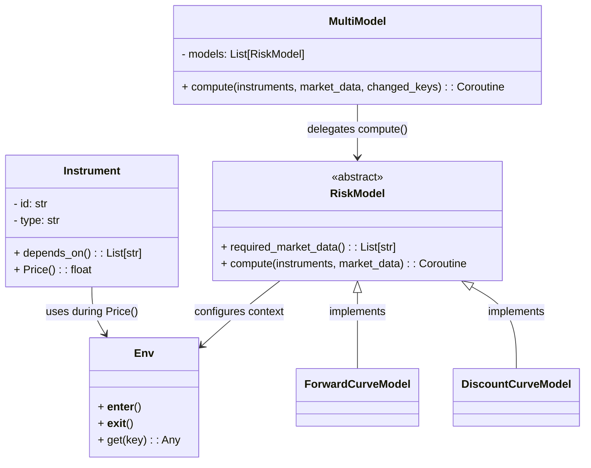
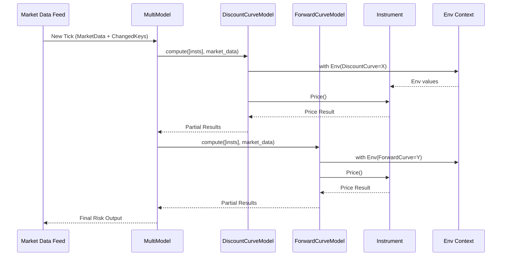

# Async Risk Framework Architecture

This document explains the design and architecture of the event-driven asynchronous risk calculation framework built in Python. It supports plug-and-play risk models, incremental recalculation based on updated market data, and clear separation between pricing logic and risk model orchestration.

---

## Class Architecture

---

## Data Flow Diagram

---

## Key Concepts

### 1. `Instrument`

* Knows its dependencies (e.g., DiscountCurve, ForwardCurve).
* Owns pricing logic inside `Price()` method.

### 2. `RiskModel`

* Declares which market data it needs.
* `compute()` method sets the appropriate data in `Env`, then calls `Instrument.Price()`.

### 3. `MultiModel`

* Delegates work to submodels based on intersection of:

  * Instrument's dependencies
  * Model's required market data
  * Actually changed market data

### 4. `Env`

* Singleton-like context manager using `contextvars`.
* Supports nested scopes and automatic restoration.

---

## Extension Ideas

* Integrate caching of previous instrument results.
* Model hierarchy (parent/child models) for composite risk views.
